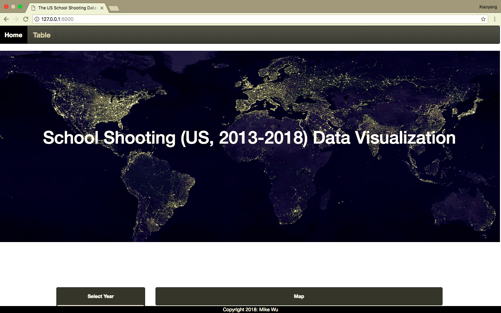

# School_Shooting_Visualization

## Link: 

### Project Introduction:

A school shooting is an attack at an educational institution, such as a school or university, involving the use of a firearm(s). Incidents that involve four or more deaths are also categorized as mass shootings.
According to studies, factors behind school shooting include family dysfunction, lack of family supervision, and mental illness. Among the topmost motives of attackers were: bullying/persecution/threatened (75%) and revenge (61%), while 54% reported having numerous reasons. The remaining motives included an attempt to solve a problem (34%), suicide or depression (27%), and seeking attention or recognition (24%).
School shootings have sparked a political debate over gun violence, zero tolerance policies, and gun control.
The United States has the highest number of school-related shootings.
I wanted to make a data visualziation web dashboard to show more insights about this kind of gun tragedies around us.

### Project Procedures:

* Scraped School Shooting data from https://everytownresearch.org/gunfire-in-school/ and          https://en.wikipedia.org/wiki/List_of_school_shootings_in_the_United_States with beautifulSoup, Splinter, webdriver
* Explored, cleaned, merged Data into one data table using excel and pandas
* Saved and pulled cleaned data into local Sqlite using SQalchemy 
* Designed Front-end prject apearance in html and determined which visualization are needed to showcase data stories
* Constructed endpoint from local APIs (Flask) to send data and data struture supports for each visualziation
* Coordinated with Flask, I visualized interative charts, a map and 2 table to tell stories from different perspectives using    Javascript, JQuery, D3, Plotly.js, mapbox and Leaflet
* Troubleshoot and debugging throughout the whole process to make sure each functions designed went on successfully
* In the end, beautified two pages of website with bootstrap in layout, buttons, tables and then borrowed front images from https://www.pexels.com/
* Deployed the whole web project on Heroku for more dispalying flexibility

### Project Preview

